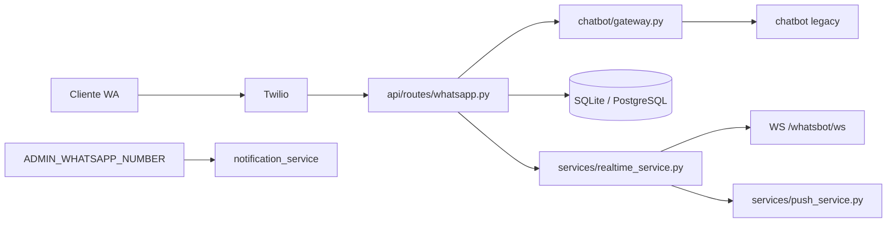

# Arquitectura WhatsBot

Backend **FastAPI** multi-negocio para bot de WhatsApp. El cliente externo (app móvil u otro consumidor REST/WS) se integra por la API.

## Componentes

| Componente | Ubicación |
|------------|-----------|
| Chatbot WhatsApp | `chatbot/` — gateway + lógica conversacional |
| Config | `config/` — settings, intents, prompts |
| API REST + WebSocket | `api/` — FastAPI |
| Servicios | `services/` — negocio, pedidos, conversaciones, notificaciones |
| Persistencia | SQLite (dev) / PostgreSQL (prod) + Google Sheets opcional |
| Cache / pub-sub | Redis opcional (multi-worker WS fanout) |

## Modelo de números

```
Cliente     → TWILIO_WHATSAPP_FROM (línea del bot del negocio)
Dueño       → API REST + WebSocket (JWT por negocio)
Dueño       → ADMIN_WHATSAPP_NUMBER (confirmación legacy, se mantiene)
```

## Flujo de mensaje entrante



## Flujo de mensaje saliente (dueño → cliente)

```
POST /whatsbot/messages  →  save_outgoing_message()  →  Twilio REST  →  cliente WA
                         →  emit_message_saved()      →  WebSocket
```

## Capas

1. **config/** — Settings globales y defaults editables.
2. **chatbot/** — Única puerta de entrada: `handle_incoming_message()`; no reescribir parser/flow.
3. **api/** — JSON REST + WebSocket. Webhook Twilio.
4. **services/** — Negocio, menú, pedidos, conversaciones, notificaciones.
5. **infrastructure/** — BD, cache Redis, cliente Twilio.

## Tiempo real

| Canal | Cuándo | Uso |
|-------|--------|-----|
| WebSocket `WS /whatsbot/ws?token=JWT` | Consumidor conectado, `REALTIME_ENABLED=true` | `message.new`, `order.pending`, ticks de estado |
| FCM/APNs | Consumidor background/cerrado, `FCM_ENABLED=true` | Push si no hay WS activo |
| REST sync | Reconexión WS o vuelta de red | `?since=` / `?after_id=` |

## Multi-tenant

- Modelo `Business` en BD — cada negocio tiene ID, Twilio, PIN, menú, intents y mensajes propios.
- Auth JWT por negocio — cada dueño solo ve sus datos.
- `business_id` en conversaciones, pedidos y mensajes — todo aislado.
- Webhook Twilio identifica el negocio por `To` → `twilio_whatsapp_from`.

## Prohibiciones

- No exponer `TWILIO_AUTH_TOKEN` ni secrets de servidor fuera del backend.
- Terminología: `business` / `negocio`, no `restaurant` en código nuevo.
