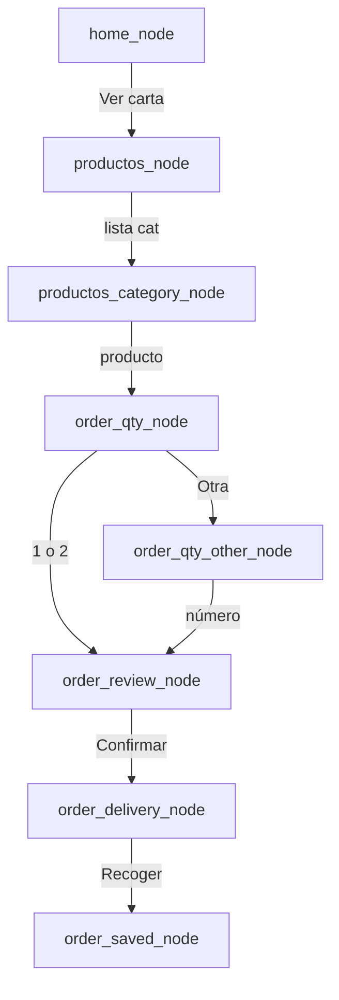

# Flujo MVP (botones)

## Checklist general:

- [x] home → productos
- [x] productos → category
- [ ] category → qty
- [ ] qty → review
- [ ] delivery recoger → sav

## Checklist por nodo (mínimo)

### home_node

- [x] Mensaje: bienvenida se ve bien
- [x] Entrada: botón Ver menú
- [x] Siguiente: → productos_node
- [ ] Escape / basura: fallback OK

### productos_node

- [ ] Mensaje: texto menú + lista categorías
- [x] Entrada: elegir categoría de la lista
- [x] Siguiente: → productos_category_node
- [ ] Escape: inicio → home

### productos_category_node

- [ ] Mensaje: “Selecciona un producto” + lista
- [x] Entrada: tap producto
- [x] Siguiente: → order_qty_node
- [ ] Escape: inicio → home


### order_qty_node

- [ ] Mensaje: producto + precio + ¿cuántas?
- [x] Entrada: 1 / 2 / Otra
- [x] Siguiente: 1|2 → review · Otra → qty_other
- [ ] Escape: inicio → home


### order_qty_other_node

- [ ] Mensaje: “escribe el número” (sin botones)
- [x] Entrada: número 1–20
- [x] Siguiente: → order_review_node
- [ ] Escape: inicio → home


### order_review_node

- [ ] Mensaje: carrito + total + ¿alistamos?
- [x] Entrada: Confirmar
- [x] Siguiente: → order_delivery_node
- [ ] Escape: inicio (abandon si hay cart)


### order_delivery_node

- [ ] Mensaje: ¿domicilio o recoger?
- [ ] Entrada: Recoger (MVP) / Domicilio (luego)
- [x] Siguiente: Recoger → saved o name
- [ ] Escape: inicio → home


### pago_metodo_node

- [ ] Mensaje: elige método
- [ ] Entrada: Presencial / Transferencia
- [ ] Siguiente: → presencial o transferencia
- [ ] Escape: inicio


### pago_presencial_node

- [ ] Mensaje: factura (carrito) + métodos local
- [ ] Entrada: Entendido
- [ ] Siguiente: → order_saved
- [ ] Escape: inicio


### pago_transferencia_node

- [ ] Mensaje: factura + cuentas + pantallazo
- [ ] Entrada: Ya envié
- [ ] Siguiente: → order_saved
- [ ] Escape: inicio


### order_customer_name_node

- [ ] Mensaje: pide nombre
- [ ] Entrada: nombre ≥ 2 letras
- [ ] Siguiente: → order_saved_node
- [ ] Escape: inicio → home


### order_address_node

- [ ] Mensaje: dirección guardada + confirmar/cambiar
- [ ] Entrada: Confirmar / Cambiar
- [ ] Siguiente: Confirmar → saved/name · Cambiar → edit
- [ ] Escape: inicio → home


### order_address_edit_node

- [ ] Mensaje: escribe dirección
- [ ] Entrada: texto dirección
- [ ] Siguiente: → order_address_confirm_node
- [ ] Escape: inicio → home


### order_address_confirm_node

- [ ] Mensaje: muestra dirección + ¿correcta?
- [ ] Entrada: Confirmar / Cambiar
- [ ] Siguiente: Confirmar → saved/name · Cambiar → edit
- [ ] Escape: inicio → home


### order_saved_node

- [ ] Mensaje: pedido registrado (id/total)
- [x] Entrada: — (automático)
- [ ] Siguiente: fin (null)
- [ ] Extra: pedido llega a admin / BD




En Cursor: abre el md → preview Markdown (o extensión Mermaid). **Editas líneas, no cajas.**

---


### Cómo “chulear” sin mouse

Debajo del diagrama, checklist teclado:

```markdown

```


## Checklist

- [x] home → productos
- [x] productos → category
- [ ] category → qty
- [ ] qty → review
- [ ] delivery recoger → saved

```

```

